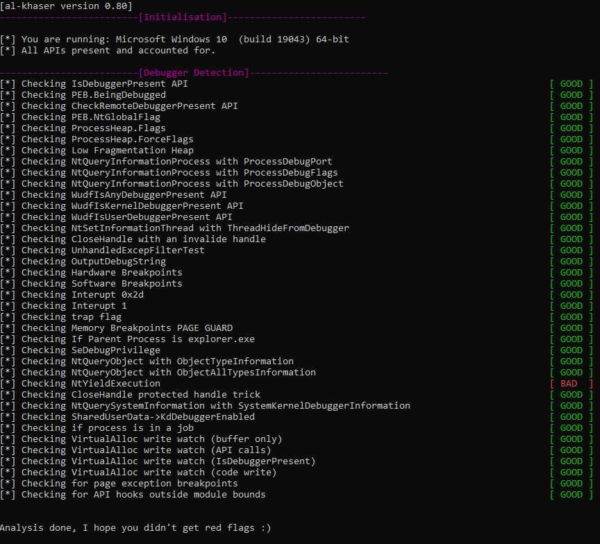

# HyperHide #

**Table of Contents**

- [Description](#Description)
- [Compilation](#Compilation)
- [Support](#Support)
- [Usage Information](#usage-Information)
- [Examples](#Examples)
- [Features](#Features)
  * [1. Process Environment Block (PEB)](#1-Process-environment-block--peb-)
  * [2. Heap Flags](#2-heap-flags)
  * [3. Process Flags](#3-process-flags)
  * [4. Thread Flags](#4-thread-flags)
  * [5. KUserSharedData](#5-kusershareddata)
  * [6. KiExceptionDisptach](#6-kiexceptiondisptach)
  * [7. NtQueryInformationProcess](#7-ntqueryinformationprocess)
  * [8. NtQueryInformationThread](#8-ntqueryinformationthread)
  * [9. NtQueryInformationJobObject](#9-ntqueryinformationjobobject)
  * [10. NtQueryObject](#10-ntqueryobject)
  * [11. NtQuerySystemInformation](#11-ntquerysysteminformation)
  * [12. NtQuerySystemTime](#12-ntquerysystemtime)
  * [13. NtQueryPerformanceCounter](#13-ntqueryperformancecounter)
  * [14. NtSetInformationThread](#14-ntsetinformationthread)
  * [15. NtSetInformationProcess](#15-ntsetinformationprocess)
  * [16. NtSystemDebugControl](#16-ntsystemdebugcontrol)
  * [17. NtClose](#17-ntclose)
  * [18. NtSetContextThread](#18-ntsetcontextthread)
  * [19. NtGetContextThread](#19-ntgetcontextthread)
  * [20. NtCreateThreadEx](#20-ntcreatethreadex)
  * [21. NtCreateProcessEx](#21-ntcreateprocessex)
  * [22. NtCreateUserProcess](#22-ntcreateuserprocess)
  * [23. NtCreateFile](#23-ntcreatefile)
  * [24. NtYieldExecution](#24-ntyieldexecution)
  * [25. NtOpenProcess](#25-ntopenprocess)
  * [26. NtOpenThread](#26-ntopenthread)
  * [27. NtGetNextProcess](#27-ntgetnextprocess)
  * [28. NtContinue](#28-ntcontinue)
  * [29. NtUserFindWindowEx](#29-ntuserfindwindowex)
  * [30. NtUserGetForegroundWindow](#30-ntusergetforegroundwindow)
  * [31. NtUserQueryWindow](#31-ntuserquerywindow)
  * [32. NtUserBuildHwndList](#32-ntuserbuildhwndlist)
- [Remarks](#remarks)
- [License](#license)
- [Special thanks to](#special-thanks-to)

# Description #

HyperHide is open-source hypervisor based Anti-Anti-Debug plugin for x64dbg/x32dbg.  HyperHide uses Intel ept to hook various syscalls and also other functions which can be used to spot the presence of debugger.

# Compilation #
In order to compile project you need  [WDK](https://docs.microsoft.com/en-us/windows-hardware/drivers/download-the-wdk "WDK") and Visual Studio 2019

# Support #
HyperHide supports all Windows versions from Windows 7 up to the newest version (x64 only), and works only on intel processors with VT-x and EPT support.

# Usage Information #
Download pre compiled binaries or compile source code yourself.

Turn on test signing mode by running below command in cmd with administrator rights (after turning on restart system)

`bcdedit /set testsigning on`

Put **HyperHideDrv.sys** and **airhv.sys** to **C:\Windows\System32\drivers** then
open **Scripts** folder in repository and execute **create.bat** with administrator rights.
In order to turn on both drivers execute **on.bat** with administrator rights. 
If you want to turn off both airhv and HyperHideDrv execute **off.bat** with administrator rights (remember to turn off all x64dbg/x32dbg instances before turning off drivers).

32-bit: Copy **HyperHide.ini** and **HyperHide.dp32** to your \x32\plugins\ directory. 

64-bit: Copy **HyperHide.ini** and **HyperHide.dp64** to your \x64\plugins\ directory.

To check if HyperHide is working correctly, use DebugView.

# Examples #

Output from al-khaser 64 bit:

Output from al-khaser 32 bit:

# Features #
## 1. Process Environment Block (PEB) ##
The most important anti-anti-debug option. Almost every protector checks for PEB values.

First and the most important one is BeingDebugged field in PEB.
This field is set when you start process with debugger and indicates its presence.

Second is NtGlobalFlag field. It is set to 0 by deafult but when process is started
by debugger the following flags are set
 
 * **FLG_HEAP_ENABLE_TAIL_CHECK (0x10)**
 * **FLG_HEAP_ENABLE_FREE_CHECK (0x20)**
 * **FLG_HEAP_VALIDATE_PARAMETERS (0x40)**

When **Clear Peb BeingDebugged** checkbox is set in plugin options then everytime you start debugging HyperHideDrv will clear BeingDebugged.

When **Clear Peb NtGlobalFlag** checkbox is set in plugin options then everytime
you start debugging HyperHidDrv will clear NtGlobalFlag
**(Do not use if you are attaching to existing process)**.

## 2. Heap Flags ##
Heap contains two flags which are affected by debugger.

First is Flags field in heap which by default is set to **HEAP_GROWABLE**
when process is started by debugger Flags is set to combination of these flags:

x86:
 * **HEAP_GROWABLE (2)**
 *  **HEAP_TAIL_CHECKING_ENABLED (0x20)**
 * **HEAP_FREE_CHECKING_ENABLED (0x40)**
 *  **HEAP_SKIP_VALIDATION_CHECKS (0x10000000)**
 * **HEAP_VALIDATE_PARAMETERS_ENABLED (0x40000000)**

x64:
 *  **HEAP_GROWABLE (2)**
 *   **HEAP_TAIL_CHECKING_ENABLED (0x20)**
 *  **HEAP_FREE_CHECKING_ENABLED (0x40)**
 *  **HEAP_VALIDATE_PARAMETERS_ENABLED (0x40000000)**
 
Second one is ForceFlags which by default is set to 0
When process is started by debugger, ForceFlags is set to combination of these flags:
 * **HEAP_TAIL_CHECKING_ENABLED (0x20)**
 * **HEAP_FREE_CHECKING_ENABLED (0x40)**
 * **HEAP_VALIDATE_PARAMETERS_ENABLED (0x40000000)**
 
 
 When **Clear Heap Flags** checkbox is set in plugin options, then everytime you start debugging HyperHideDrv will clear set Flags and ForceFlags to their default value
**(Do Not use if you are attaching to existing process).**

## 3. Process Flags  ##
Windows uses various process flags which can be used to detect debugger or to
make the debugging harder.
- First flag is BreakOnTermination. When set process termination leads to bsod

When **Clear ProcessBreakOnTermination** checkbox is set in plugin options, then everytime you start debugging HyperHideDrv will clear this field in debugged process 
EPROCESS struct and save information if it was set or not for further use in NtQueryInformationProcess **(Do Not use if you are starting process with debugger).**
 
 - Second flag is ProcessHandleTracing. It indicates if process handle tracing is enable or not.

When **Save ProcessHandleTracing** checkbox is set in plugin options, then everytime you start debugging HyperHideDrv will save information if it was set or not for further use in NtQueryInformationProcess **(Do Not use if you are starting process with debugger).**

- Third flag is ProcessDebugFlags

When **Save ProcessHandleTracing** checkbox is set in plugin options then everytime you start debugging HyperHideDrv will save information if it was set or not for further use in NtQueryInformationProcess **(Do Not use if you are starting process with debugger).**

## 4. Thread Flags ##
Windows uses various thread flags which can be used to detect debugger or to
make the debugging harder.

- First flag is ThreadHideFromDebugger. When set debugger loses control under thread.

When **Clear ThreadHideFromDebugger Flag** checkbox is set in plugin options, then everytime you start debugging HyperHideDrv will clear this field in debugged process 
thread ETHREAD struct and save information if it was set or not for further use in NtQueryInformationThread **(Do Not use if you are starting process with debugger)**.

- Second flag is BreakOnTermination. When set thread termination leads to bsod.

When **Clear ThreadBreakOnTermination** checkbox is set in plugin options, then everytime you start debugging HyperHideDrv will clear this field in debugged process 
thread ETHREAD struct and save information if it was set or not for further use in NtQueryInformationThread **(Do Not use if you are starting process with debugger)**.

- Third flag is BypassProcessFreeze. When set calling NtSuspendProcess will ignore
all threads which have this flag set (Flag exist on Windows version 19h1 up to the newest).

When **Clear BypassProcessFreeze Flag** checkbox is set in plugin options then everytime you start debugging HyperHideDrv will clear this field in debugged process 
thread KTHREAD struct **(Do Not use if you are starting process with debugger)**.

## 5. KUserSharedData ##

KUserShared data is global shared page between all usermode processes
located always in same exact address (0x7FFE0000). KUserShared has a lot of counters
which can be used to perform time attacks. 

When **KUserSharedData** checkbox is set in plugin options then everytime you start debugging HyperHideDrv will swap pfn of process kusd with fake one.
Everytime when process is paused HyperHideDrv will stop updating counters.
And after resuming counter would have values derrived from kernel version of KUserShared located always in same exact addres (0xFFFFF78000000000) minus the time when they were paused.

When **Clear KUserSharedData** checkbox is set in plugin options then HyperHideDrv will clear KdDebuggerEnabled field (works only if usermode kusershareddata page is replaced with fake one)

## 6. KiExceptionDisptach ##

KiExceptionDisptach is kernelmode function responsible for handling exceptions.
HyperHideDrv hook it to clear debug registers or to send fake debug context if it was previously set with NtSetContextThread\NtSetInformationThread\NtContinue. 

When **KiExceptionDisptach** checkbox is set in plugin options then everytime you start debugging HyperHideDrv will hook this function 

## 7. NtQueryInformationProcess ##

NtQueryInformationProcess can be called with various PROCESSINFOCLASS values to detect debugger, for example:

  * **ProcessDebugPort** is used to retrive port number of the debugger for the process. If process is debuged this function writes -1 (0xFFFFFFFFFFFFFFFF) to buffer passed in ProcessInformation. Otherwise it writes 0 (HyperHideDrv always return 0).
  
  * **ProcessDebugObjectHandle** is used to query debug object handle if there is no attached debugger function write 0 to passed buffer and return status STATUS_PORT_NOT_SET (0xC0000353). HyperHideDrv will always return STATUS_PORT_NOT_SET
  
  * **ProcessDebugFlags** is used to query process flag NoDebugInherit. If debugger is attached function returns 0 otherway it returns 1. HyperHideDrv will return value previosly saved from NtSetInformationProcess or value which was saved while attaching.
  
  * **ProcessBreakOnTermination** is used to retrive information if process has BreakOnTermination flag set or not. HyperHideDrv will return value previously saved from NtSetInformationProcess or value which was cleared while attaching.
  
  *  **ProcessBasicInformation** is used to retrive information of process parent id.
  HyperHide will return explorer.exe pid.
  
  * **ProcessIoCounters** is used to retrive informaton about io counters. HyperHideDrv will write 1 to OtherOperationCount field in IO_COUNTERS.
  
  * **ProcessHandleTracing** is used to retrive information if process handle tracing is enabled. HyperHideDrv will return value previously saved from NtSetInformationProcess or value which was saved while attaching.

When **NtQueryInformationProcess** checkbox is set in plugin options then everytime you start debugging HyperHideDrv will hook this function and handles above cases.

## 8. NtQueryInformationThread ##

NtQueryInformationThread can be called with various THREADINFOCLASS values to detect debugger for example:

  * **ThreadHideFromDebugger** is used to check if thread which handle to was passed in ThreadHandle function parameter has HideFromDebugger flag set or not.
  HyperHideDrv will return to 0 or 1 depends if process previously attempted to hide thread via NtSetInformationThread or if thread was hidden while attaching to process.
  
  * **ThreadBreakOnTermination**  is used to retrive information if thread has BreakOnTermination flag set or not. HyperHideDrv will return value previously saved from
NtSetInformationThread or value which was cleared while attaching.
  
  * **ThreadWow64Context** is used to retrive WOW64 context. Can be used only on thread which belongs to WOW64 process. HyperHideDrv will return zeroed or fake debug registers which was previously set in NtSetInformationThread with flag ThreadWow64Context.

When **NtQueryInformationThread** checkbox is set in plugin options then everytime you start debugging HyperHideDrv will hook this function and handles above cases.

## 9. NtQueryInformationJobObject ##

NtQueryInformationJobObject called with JOBOBJECTINFOCLASS  JobObjectBasicProcessIdList can be used to list ids of all processes assiociated with the job and its child jobs. One of them can be a debugger, for example x64dbg/x32dbg. HyperHideDrv will check all pids and clear it if it is same as debugger pid.

When **NtQueryInformationJobObject** checkbox is set in plugin options then everytime you start debugging HyperHideDrv will hook this function and handles above case.

## 10. NtQueryObject ##

NtQueryObject called with OBJECT_INFORMATION_CLASS ObjectTypeInformation or 
ObjectTypesInformation can be used to get number of existing DebugObject handles.
Since debuggers create such handle when they are debugging HyperHideDrv will return decremented number of DebugObject handles one per each active debugger.

When **NtQueryObject** checkbox is set in plugin options then everytime you start debugging HyperHideDrv will hook this function and handle above cases.

## 11. NtQuerySystemInformation ##

NtQuerySystemInformation called with OBJECT_INFORMATION_CLASS:

* **SystemKernelDebuggerInformation**, **SystemKernelDebuggerFlags** and **SystemKernelDebuggerInformationEx** can be used to check if there is active kernel debugger . HyperHideDrv will always return that there are not any active kernel debuggers.
  
  * **SystemProcessInformation**, **SystemSessionProcessInformation**, **SystemExtendedProcessInformation** and **SystemFullProcessInformation**
 can be used to list all existing processes all their threads and their parent
 process id. HyperHideDrv will filter all forbidden processes like x64dbg/x32dbg, procmon,  procexp and also will set explorer.exe as parent process pid.
  
* **SystemCodeIntegrityInformation** is used to check if code integrity options is enabled. If it is not then you can load unsigned driver like for example HyperHideDrv.
HyperHideDrv will always return that code integrity is enabled.

* **SystemExtendedHandleInformation** and **SystemHandleInformation** is used
to list all existing handles and process id which they belongs to.
HyperHideDrv will filter all handles which belong to forbidden processes like  x64dbg/x32dbg, procmon, procexp.

When **NtQuerySystemInformation** checkbox is set in plugin options then everytime you start debugging HyperHideDrv will hook this function and handles above cases.

## 12. NtQuerySystemTime ##

NtQuerySystemTime can be used to query system time. HyperHideDrv will take SystemTime value from hooked KUserSharedData if there is one, otherway it will call original NtQuerySystemTime save it value and eveytime later it will increment this saved value and return it.

When **NtQuerySystemTime** checkbox is set in plugin options then everytime you start debugging HyperHideDrv will hook this function and hande it.

## 13. NtQueryPerformanceCounter ##

Same as in NtQuerySystemTime

When **NtQueryPerformanceCounter** checkbox is set in plugin options then everytime you start debugging HyperHideDrv will hook this function and hande it.

## 14. NtSetInformationThread ##

NtSetInformationThread can be called with various THREADINFOCLASS values to detect debugger for example:

*  **ThreadHideFromDebugger** is used to hide process from debugger.
HyperHideDrv will ignore that request and save information that this thread was requested to be hidden and will use that information later in NtQueryInformationThread.

* **ThreadWow64Context** is used to set WOW64 thread context. Can be used only on thread which belongs to WOW64 process. HyperHideDrv will ignore that request and save debug registers passed in context and use later in NtQueryInformationThread.

* **ThreadBreakOnTermination** is used to set thread BreakOnTermination flag. When thread with this flag set is terminated bsod is throwed. HyperHideDrv ignore that request and save that information for later use in NtQueryInformationThread.

When **NtSetInformationThread** checkbox is set in plugin options then everytime you start debugging HyperHideDrv will hook this function and hande above cases.

## 15. NtSetInformationProcess ## 

NtQueryInformationProcess can be called with various PROCESSINFOCLASS values to detect debugger for example:
  
  * **ProcessDebugFlags** is used to set process flag NoDebugInherit. HyperHideDrv will save that information for later use in NtQueryInformationProcess.
  
  * **ProcessBreakOnTermination** is used to set BreakOnTermination flag. When process with this flag set is terminated bsod is throwed. HyperHideDrv will ignore that request and save that information for later use in NtQueryInformationProcess.
  
  * **ProcessHandleTracing** is used to enable process handle tracing.
HyperHideDrv will save that information for later use in NtQueryInformationProcess.

When **NtSetInformationProcess** checkbox is set in plugin options then everytime you start debugging HyperHideDrv will hook this function and hande above cases.

## 16. NtSystemDebugControl ##

NtSystemDebugControl should return always STATUS_DEBUGGER_INACTIVE if there is no active debugger or in case when Command is set to SysDbgGetTriageDump return should be STATUS_INFO_LENGTH_MISMATCH

When **NtSystemDebugControl** checkbox is set in plugin options then everytime you start debugging HyperHideDrv will hook this function and hande it.

## 17. NtClose ##

NtClose is used to close a handle. If there is a active debugger attempting to close
invalid handle or protected one, the function throws an exception. HyperHideDrv check if such conditions are met and return without exception being throwed.

When **NtClose** checkbox is set in plugin options then everytime you start debugging HyperHideDrv will hook this function and hande it.

## 18. NtSetContextThread ##

NtSetContextThread can be used to clear/set dr registers which are used for hardware breakpoints. HyperHideDrv will clear flag in ContextFlags so it won't change dr register.
It will also save dr values from passed context for later use in NtGetContextThread\KiExceptionDispatch.

When **NtSetContextThread** checkbox is set in plugin options, then everytime you start debugging HyperHideDrv will hook this function and hande it.

## 19. NtGetContextThread ##

NtGetContextThread can be used to retrive context with dr registers which are used for hardware breakpoints. HyperHideDrv will set these dr registers in context to this previously saved in NtSetContextThread and if there aren't any it will be zeroed.

When **NtGetContextThread** checkbox is set in plugin options, then everytime you start debugging HyperHideDrv will hook this function and hande it.

## 20. NtCreateThreadEx ##

NtCreateThreadEx is used to create a thread. It is possible to pass thread flags to function for example HideFromDebugger or FreezeBypassProcessFreeze.
HyperHideDrv will create thread and ignore these flags at the same time will save information about them for further use in NtQueryInformationThread.

When **NtCreateThreadEx** checkbox is set in plugin options, then everytime you start debugging HyperHideDrv will hook this function and hande it.

## 21. NtCreateProcessEx ##

Similar to NtCreateUserProcess but **NtCreateProcessEx is deprecated** and not used in new windows versions.

When **NtCreateProcessEx** checkbox is set in plugin options, then everytime you start debugging HyperHideDrv will hook this function and hande it.

## 22. NtCreateUserProcess ##

NtCreateUserProcess is used to create process. HyperHideDrv will hide newly created process until debugger or new process exit.

When **NtCreateUserProcess** checkbox is set in plugin options, then everytime you start debugging HyperHideDrv will hook this function and hande it.

## 23. NtCreateFile ##

NtCreateFile can be used to create a handle to a driver. HyperHideDrv will check if debugged process want to create handle to one of forbidden driver.

When **NtCreateFile** checkbox is set in plugin options, then everytime you start debugging HyperHideDrv will hook this function and hande it.

## 24. NtYieldExecution ##

This method is not really reliable because it only shows if there a high priority thread in the current process. HyperHideDrv will always return STATUS_SUCCESS.

When **NtYieldExecution** checkbox is set in plugin options, then everytime you start debugging HyperHideDrv will hook this function and hande it.

## 25. NtOpenProcess ##

NtOpenProcess can be used to enumerate all existing process since every process
has it own pid. HyperHideDrv will check if pid belongs to any forbidden process like
x64dbg/x32dbg, procmon, procexp.

When **NtOpenProcess** checkbox is set in plugin options then, everytime you start debugging HyperHideDrv will hook this function and hande it.

## 26. NtOpenThread ##

Same as NtOpenProcess but instead pid it uses tid (Thread ID)

When **NtOpenThread** checkbox is set in plugin options, then everytime you start debugging HyperHideDrv will hook this function and hande it.

## 27. NtGetNextProcess ##

Same as NtOpenProcess but instead pid it uses process handle

When **NtGetNextProcess** checkbox is set in plugin options then everytime you start debugging HyperHideDrv will hook this function and hande it.

## 28. NtContinue ##

Same as NtSetContextThread

When **NtContinue** checkbox is set in plugin options then everytime you start debugging HyperHideDrv will hook this function and hande it.

## 29. NtUserFindWindowEx ##

NtUserFindWindowEx can be used to retrieve a handle to the top-level window whose class name and window name match the specified strings.
HyperHideDrv will check if specified names are forbidden.

When **NtUserFindWindowEx** checkbox is set in plugin options then everytime you start debugging HyperHideDrv will hook this function and hande it.

## 30. NtUserGetForegroundWindow ##

NtUserGetForegroundWindow can be used to retrieve a handle to the foreground window. If it is handle to debugger window then HyperHideDrv return NtUserGetThreadState with THREADSTATE_ACTIVEWINDOW.

When **NtUserGetForegroundWindow** checkbox is set in plugin options then everytime you start debugging HyperHideDrv will hook this function and hande it.

## 31. NtUserQueryWindow ##

NtUserQueryWindow can be used to retrieve the identifier of the thread that created the specified window or the identifier of the process that created the window.
HyperHideDrv will check if window handle belongs to debugger and return debugged process pid or tid.

When **NtUserQueryWindow** checkbox is set in plugin options then everytime you start debugging HyperHideDrv will hook this function and hande it.

## 32. NtUserBuildHwndList ##

NtUserBuildHwndList can be used to list all windows.
HyperHideDrv will find every handle to forbidden window and clear information about it.

When **NtUserBuildHwndList** checkbox is set in plugin options then everytime you start debugging HyperHideDrv will hook this function and hande it.

# Remarks #

**Never run this driver on production system. Use virtual machine instead**

# License #
HyperHide is under the [GNU General Public License v3.](https://www.gnu.org/licenses/gpl-3.0.en.html "GNU General Public License v3.")

# Special thanks to #
[ScyllaHide](https://github.com/x64dbg/ScyllaHide "ScyllaHide") developers

[al-khaser](https://github.com/LordNoteworthy/al-khaser "al-khaser") by [Noteworthy](https://github.com/LordNoteworthy "Noteworthy")

[Check Point](https://research.checkpoint.com/about-us/ "Check Point") for [Anti-Debug Tricks](https://anti-debug.checkpoint.com/ "Anti-Debug Tricks")

Peter Ferrie for his [Anti-Debug pdf](https://anti-reversing.com/Downloads/Anti-Reversing/The_Ultimate_Anti-Reversing_Reference.pdf "a")